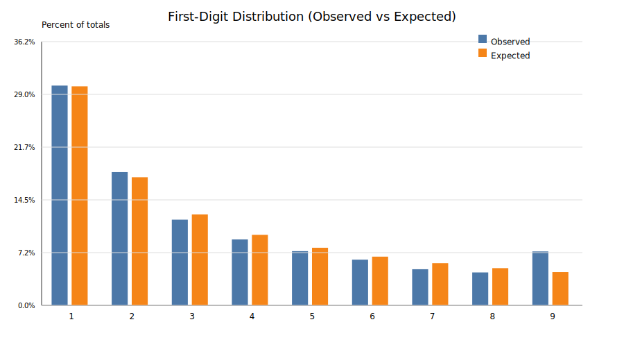
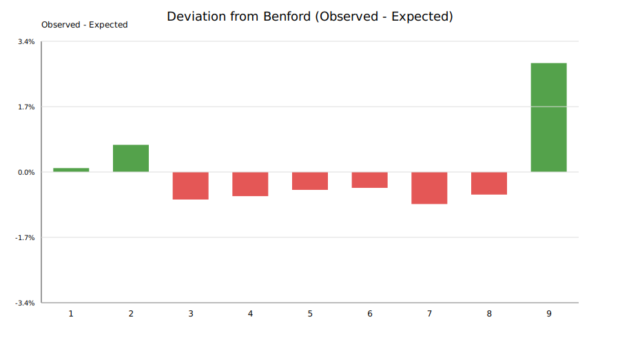

# Benford Analysis Report

Total non-zero amounts analyzed: **37,905**

## First-digit distribution

| Digit | Observed Count | Observed % | Expected % | Deviation (Obs - Exp) |
| --- | --- | --- | --- | --- |
| 1 | 11,449 | 30.20% | 30.10% | +0.10% |
| 2 | 6,943 | 18.32% | 17.61% | +0.71% |
| 3 | 4,464 | 11.78% | 12.49% | -0.72% |
| 4 | 3,435 | 9.06% | 9.69% | -0.63% |
| 5 | 2,825 | 7.45% | 7.92% | -0.47% |
| 6 | 2,381 | 6.28% | 6.69% | -0.41% |
| 7 | 1,882 | 4.97% | 5.80% | -0.83% |
| 8 | 1,716 | 4.53% | 5.12% | -0.59% |
| 9 | 2,810 | 7.41% | 4.58% | +2.84% |

Mean absolute deviation (MAD): **0.0081**
Chi-square statistic: **800.10**

MAD guidance (Nigrini):

- 0.000–0.006: Close conformity

- 0.006–0.012: Acceptable conformity

- 0.012–0.015: Marginally acceptable

- >0.015: Nonconformity